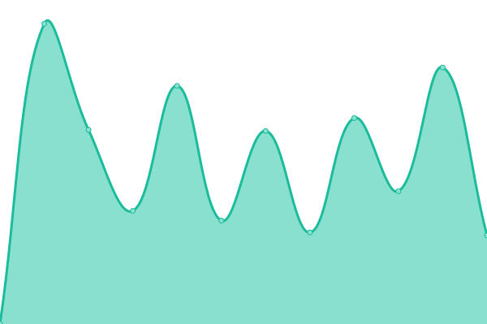

# [📈 Live Status](https://demo.upptime.js.org): <!--live status--> **🟩 All systems operational**

This repository contains the open-source uptime monitor and status page for [zhujunyong](https://demo.upptime.js.org), powered by [Upptime](https://github.com/upptime/upptime).

With [Upptime](https://upptime.js.org), you can get your own unlimited and free uptime monitor and status page, powered entirely by a GitHub repository. We use [Issues](https://github.com/zhujunyong/upptime/issues) as incident reports, [Actions](https://github.com/zhujunyong/upptime/actions) as uptime monitors, and [Pages](https://demo.upptime.js.org) for the status page.

<!--start: status pages-->
<!-- This summary is generated by Upptime (https://github.com/upptime/upptime) -->
<!-- Do not edit this manually, your changes will be overwritten -->
<!-- prettier-ignore -->
| URL | Status | History | Response Time | Uptime |
| --- | ------ | ------- | ------------- | ------ |
|  [IBM Z Advocacy Hub](https://community.ibm.com/zsystems/advocacy/) | 🟩 Up | [ibm-z-advocacy-hub.yml](https://github.com/zhujunyong/upptime/commits/HEAD/history/ibm-z-advocacy-hub.yml) | 

 845ms
     
 | 

<a href="https://demo.upptime.js.org/history/ibm-z-advocacy-hub">100.00%</a>
    

|  [Validated Open Source Software](https://community.ibm.com/zsystems/oss/) | 🟩 Up | [validated-open-source-software.yml](https://github.com/zhujunyong/upptime/commits/HEAD/history/validated-open-source-software.yml) | 

 431ms
     
 | 

<a href="https://demo.upptime.js.org/history/validated-open-source-software">100.00%</a>
    

|  [API - core - block id 2](https://community.ibm.com/zsystems/api/core/blocks/2) | 🟩 Up | [api-core-block-id-2.yml](https://github.com/zhujunyong/upptime/commits/HEAD/history/api-core-block-id-2.yml) | 

 402ms
     
 | 

<a href="https://demo.upptime.js.org/history/api-core-block-id-2">100.00%</a>
    

|  [API - advocacy - opportunity id 1](https://community.ibm.com/zsystems/api/advocacy/opportunities/1) | 🟩 Up | [api-advocacy-opportunity-id-1.yml](https://github.com/zhujunyong/upptime/commits/HEAD/history/api-advocacy-opportunity-id-1.yml) | 

 600ms
     
 | 

<a href="https://demo.upptime.js.org/history/api-advocacy-opportunity-id-1">100.00%</a>
    

|  [API - agenda - event id 1](https://community.ibm.com/zsystems/api/agenda/events/1) | 🟩 Up | [api-agenda-event-id-1.yml](https://github.com/zhujunyong/upptime/commits/HEAD/history/api-agenda-event-id-1.yml) | 

 1112ms
     
 | 

<a href="https://demo.upptime.js.org/history/api-agenda-event-id-1">100.00%</a>
    

<!--end: status pages-->

[**Visit our status website →**](https://demo.upptime.js.org)

## 📄 License

- Powered by: [Upptime](https://github.com/upptime/upptime)
- Code: [MIT](./LICENSE) © [zhujunyong](https://demo.upptime.js.org)
- Data in the `./history` directory: [Open Database License](https://opendatacommons.org/licenses/odbl/1-0/)
